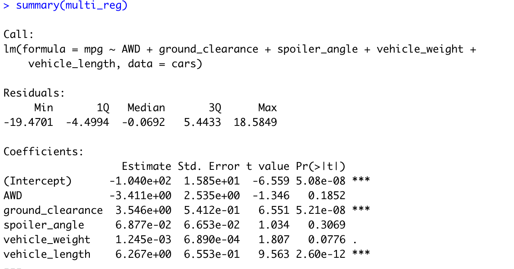
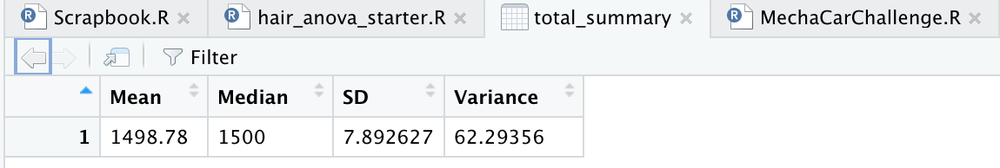
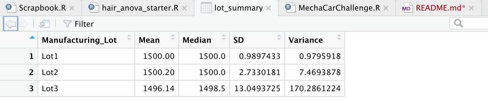
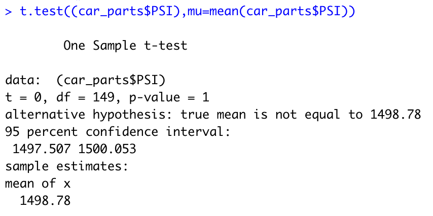
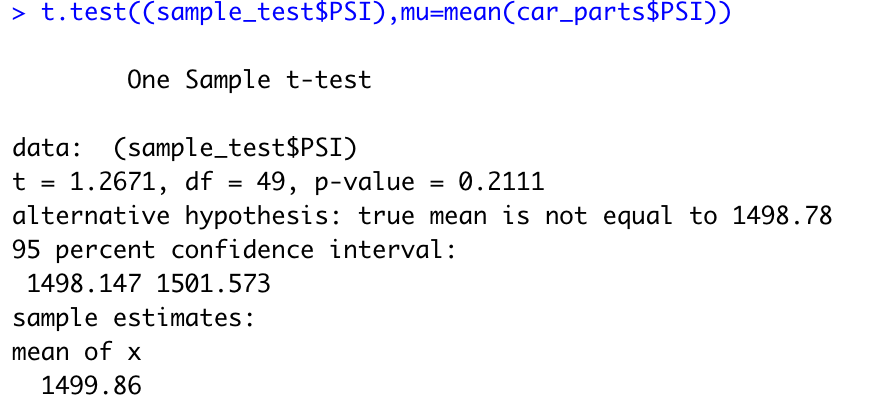
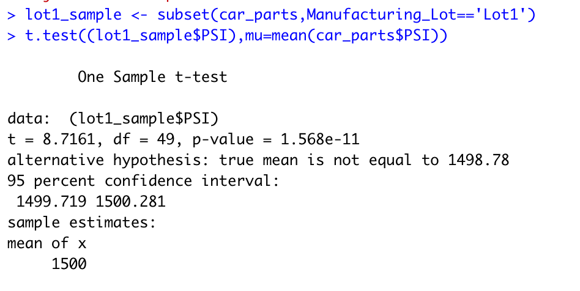
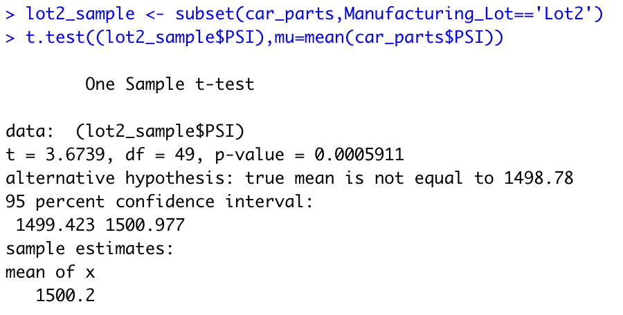
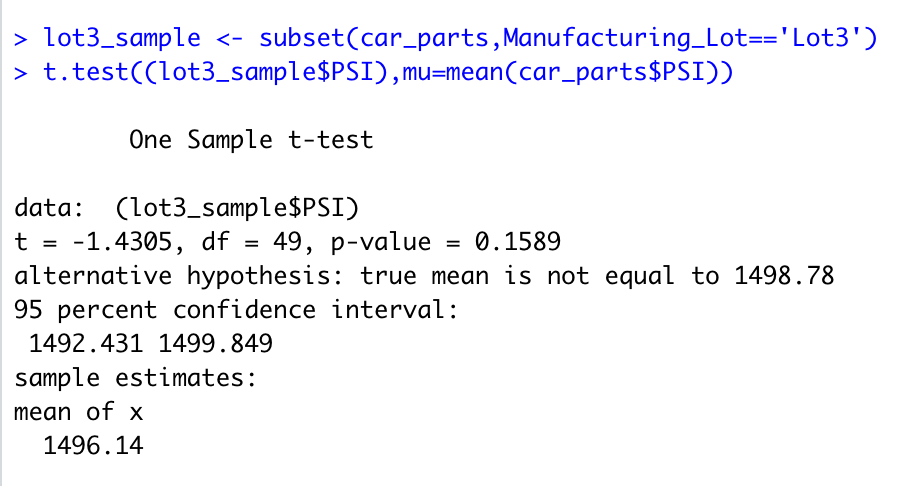

# MechaCar_Statistical_Analysis

## Linear Regression to Predict MPG
Based on the results from the regression performed we can reject the null hypothesis as there are multiple factors that fall below the determinate p-value; namely the intercept(b),ground clearance and vehicle length as seen in the following screenshot

It is also clear from the results that the slope of the linear model is NOT zero. This is based on the fact that including the intercept point the variables of ground clearance and vehicle length have p-values significantly lower than the normal level of 0.05.It should also be noted that the  vehicle weight factor is within 3 % of falling within the desired confidence level.
I believe that this linear model does a good job of predicting the the mpg of the Mechacar prototypes based on the fact that while only two of the factors had significant values below the null hypothesis, the summary r-squared value is 0.71

## Sumary Statistics on Suspension Coils
Based on the information gathered the current design does NOT meet  the design specification in total as the total variance is 62.29 or 6229 lb/inch square. 
When compared individually the only Lot that meets the specification is Lot 1 at 0.9795 or 97.95 lb/inch square

## T-Tests on Suspension Coils
The t-test results reveal that when considering all values is is not possible to reject the null hypothesis as the p-value returned is higher than allowable in the confidence test i.e = 1 . 

A sample t-test of all values further confirms this:

When considering individual lots ,Lots 1 & 2 successfully reject the null hypothesis 
with p-values lower than 0.05.

Lot 3 does not reject the null hypothesis with a value above 0.05

## Study Design :MechaCar vs Competition
In this test AutosRUs would seek to determine if the MechaCar would be successful when compared to its competitors by measuring these specific benchmarks:
*Cost
*Safety Rating
*Highway fuel economy(mpg)
*City fuel economy(mpg)
*Trim levels
*Tech features

The null hypothesis would be that MechaCar would not be any more desirable than similiar competition .
The alternative hypothesis would seek to return that if the MechaCar can deliver on all of the above metrics within a set target , then the car would sell in great volumes than the competition.

For this test I believe that a two way ANOVA would be appropriate as this tests the means of two independent variables across multiple groups.
In order to run this test more recent historical data (within last 5 years) from a target competitor would be needed and mathing data on the MechaCar would be used based on target projections for each category.